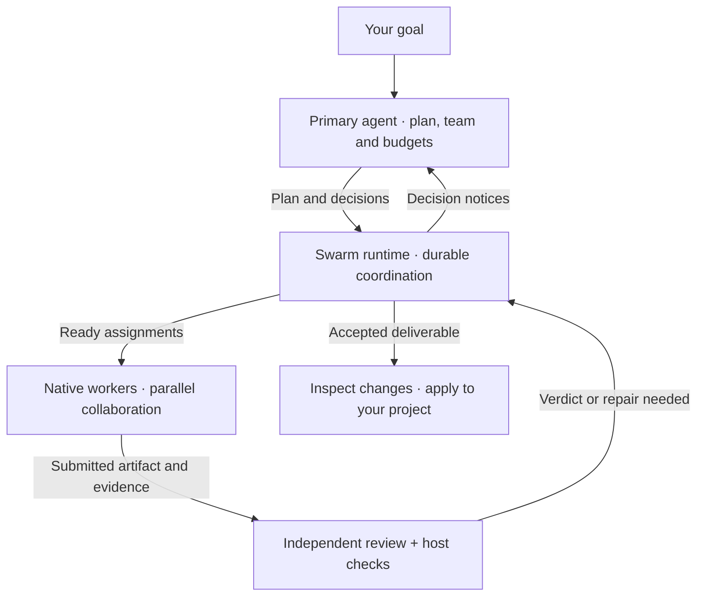

# Agent Swarm for DeepSeek Harness

**English** · [简体中文](README.zh-CN.md)

### One goal. A coordinated team. Work you can review.

Describe what you want to build, fix or investigate. Agent Swarm brings a team of collaborating agents into [DeepSeek Harness](https://github.com/deepseek-ai/deepseek-harness), with shared objectives, visible activity, independent review and a clear path back to your project.

```text
/agent-swarm Fix the duplicate search results. Preserve the API, add regression tests, and independently verify the change.
```

The primary agent inspects your project, organizes the work and chooses the team and resource budgets. You follow the mission in the sidebar and inspect the result when it is ready.

**v0.7.0 · MIT · Local Git projects · Native Harness integration**

[Get started](#get-started) · [See the UI](#ui-gallery) · [How it works](#architecture) · [中文介绍](README.zh-CN.md)

## Built for work that benefits from a team

| Your goal | How the team helps |
| --- | --- |
| Fix a difficult bug | Investigate the cause, implement a repair and have another member check the edge cases. |
| Deliver a feature across several parts of a project | Split independent work, coordinate dependencies and assemble a reviewed result. |
| Understand unfamiliar code | Gather evidence, compare findings and produce an analysis without changing the code when requested. |

**You describe the outcome. The primary agent manages the collaboration.** There is no required team-size form or token-budget setup before each mission. Members can exchange findings, ask questions, challenge evidence and hand off partial work within the mission's scope.

## From your request to your project

1. **Start with the project as it is.** A private Git snapshot captures tracked changes and non-ignored new files before planning. You do not need to make a manual commit; your branch, index and working files stay in place during capture.
2. **Let the team work together.** The primary agent sets the plan and acceptance criteria. Members run in native Harness sessions with separate Git worktrees; dependencies determine when work can start.
3. **Review the actual artifact.** A different member reviews submitted work. For code tasks, Harness also executes the declared checks against the exact submitted commit.
4. **Bring the result back when ready.** Once the mission completes, the sidebar offers **View changes** and **Apply result** for its accepted code deliverable. Application compares against the original snapshot and preserves your branch and index. It does not stage, commit or push for you.

Existing edits remain part of the baseline, so they are not presented as new swarm output. Detected merge conflicts are reported before applying changes.

## Know what is happening

The sidebar answers three practical questions: **Who is working? What just changed? What needs attention?**

- **Recognizable members.** Stable robot portraits stay with each member across role and name changes. Open a member's conversation to inspect its work.
- **Visible execution.** See the current operation, how long it has been running and how recently Harness observed it. Fresh activity drives the animation; stale signals are shown as unconfirmed.
- **Progress backed by events.** Tool results, submissions and acceptance events appear in the feed. Resource usage stays in details instead of masquerading as a completion percentage.
- **Control close at hand.** Pause, resume or stop a mission from the sidebar. Saved planning requests also expose recovery controls when startup fails.

The UI follows host state without making model requests to render updates. Operation activity is a liveness signal, not a guarantee that useful work has finished.

## UI gallery

Captured on September 15, 2026 with simulated tasks and events. The surrounding page is a local preview shell, not the Harness application. Click an image to enlarge it.

**Current plugin components** — these screenshots render the actual `ActivityPanel` with simulated data.

| Live worker activity · light theme | Accepted results and delivery · dark theme |
| --- | --- |
| [](docs/images/live-work-light.jpg) | [](docs/images/delivery-dark.jpg) |
| Follow current operations, elapsed time and recent tool events. | See the accepted result and choose when to bring it into your project. |

**Design previews** — the shared avatars and live activity components are integrated into the plugin. The complete simplified layout below remains a renderer prototype.

| Simplified sidebar layout · preview | Independent verification in progress · dark preview |
| --- | --- |
| [](docs/images/sidebar-preview-light.jpg) | [](docs/images/verification-preview-dark.jpg) |
| Keep the goal, parallel work and task controls together. | Echo is checking another member's submission; that submission still awaits acceptance. |

## Keep momentum through interruptions

A long task needs more than a launch button. Agent Swarm keeps assignments, evidence, decisions and recovery state on disk so the team can continue through supported interruption and restart paths.

**Repair without losing the task's purpose.** Replacement tasks carry the original acceptance criteria, and dependent work follows the replacement. A repaired implementation can unblock integration without rebuilding the whole plan.

**Bring decisions back to the primary agent.** Rejections, blocked work, provider problems and exhausted limits can generate durable notices. The primary agent can revise the plan, arrange a repair or adjust a budget with a recorded reason. Ordinary recovery decisions do not require you to configure the swarm again.

**Keep resource use visible.** The primary agent chooses team size, task limits, step and token budgets, recovery allowances and verification timeouts. Usage is tracked across the team, with cache and output breakdowns and the primary conversation's usage shown separately. Resuming does not reset consumption.

Recovery runs within the mission's limits. Notifications remain queued while the primary agent is offline, and a stuck native model call may delay when it can process them. Provider-reported usage and estimates for requests still in flight can also allow a budget overshoot.

## Architecture

**The primary agent chooses the direction. The runtime coordinates the work. Harness runs the agents.**



**Freedom inside a clear contract.** Workers share evidence and propose further work; the runtime checks scope, dependencies and review requirements. Peer messages cannot expand permissions, raise budgets or waive independent review.

**Recovery is part of coordination.** Durable state links each task to its attempt, artifact and decisions. When an attempt is interrupted, the runtime fences stale writes and uses the supported checkpoint, retry or reassignment path. Cases that need judgment return to the primary agent. Accepted replacements become the prerequisites for downstream work.

**Native execution, one visible mission.** Harness supplies model execution, sessions, the inbox, tools and sandboxing. The plugin owns mission coordination and verification policy; the sidebar projects mission state and observed activity. Collaboration messages use the native inbox and session log, while coordination records live in SQLite. No Harness core fork is required.

For the implementation contracts and their origins, see [design notes](docs/design.md).

## Get started

Agent Swarm currently ships as a source plugin. You need:

- **Node.js `^22.19.0 || >=24.0.0`, Git, and macOS or Linux.** Work happens in local Git repositories.
- **A built, supported DeepSeek Harness checkout.** The default target is `0.1.5-rc.1`; `0.1.3-alpha.2` and `0.1.2-rc.1` are also listed in the [exact compatibility matrix](compatibility.json).
- **A working model configuration in Harness.** Credentials stay with the host. Workers inherit the primary conversation's model unless the plan selects another route.

```sh
git clone https://github.com/TT-Wang/dsh-agent-swarm.git
cd dsh-agent-swarm
export DSH_HARNESS_ROOT="/absolute/path/to/deepseek-harness"
npm run link:dsh
npm run build
node "$DSH_HARNESS_ROOT/apps/cli/lib/bin.js" plugin --profile web add "link:$PWD"
```

Start Harness from the project you want to work on:

```sh
cd /absolute/path/to/your-project
node "$DSH_HARNESS_ROOT/apps/cli/lib/bin.js" --profile web
```

Open the authenticated launch URL printed by Harness, choose a model in a conversation, and enter `/agent-swarm` followed by your goal. The command appears in native autocomplete.

On the supported `0.1.5-rc.1` host, Agent Swarm lives in the native right sidebar beside Files. Earlier supported hosts use Better Sidebar when available, or the plugin's dock. The UI supports English, Chinese, light and dark themes.

For bundle installation, upgrades, startup recovery and configuration, see the [operations guide](docs/operations.md).

## Scope and practical limits

- **Local execution.** Distributed workers, non-Git projects and Windows execution are not supported. Retained worktrees and artifact refs need explicit cleanup.
- **Reviewable evidence.** Independent review and host checks make acceptance inspectable; they cannot guarantee that the chosen checks cover every requirement. Verification reuses installed dependencies by copying them by default, so it is not necessarily identical to CI.
- **Human-controlled workspace access.** A mission uses its session workspace or a root configured in `authorizedWorkspaces`; a matched grant is recorded as `workspaceGrantRoot`. Agents cannot grant themselves a new root through swarm tools. Confinement follows Harness's sandbox; the plugin adds no independent network or credential isolation.
- **Observable, bounded recovery.** The live UI shows operations and recorded events, not token-by-token output or a guaranteed ETA. Recovery does not promise exactly-once external side effects, arbitrary disk-fault recovery or filesystem-wide atomic application.

Details and residual risks are documented in [known limitations](docs/known-limitations.md). Integration evidence is recorded in [validation](docs/validation.md); scripted-provider tests are not model-quality or speed benchmarks.

<a id="storage-and-configuration"></a>

## Documentation and ecosystem

| Read more | What you will find |
| --- | --- |
| [Operations guide](docs/operations.md) · [中文指南](docs/operations.zh-CN.md) | Installation, supported hosts, storage, configuration, recovery and development commands. |
| [Design notes](docs/design.md) | Collaboration contracts, authority boundaries and design traceability. |
| [Validation](docs/validation.md) | Completed integration checks and the limits of their evidence. |
| [Known limitations](docs/known-limitations.md) | Detailed operating constraints and remaining issues. |

Agent Swarm can be paired with [dsh-slice-agent-loop](https://github.com/TT-Wang/dsh-slice-agent-loop) for session context management: Swarm coordinates work across members, while the slice policy manages history within each session. See the [integration notes](docs/operations.md#companion-context-policy).

Contributions are welcome. Development verification requires the repository checkout; start with the [development commands](docs/operations.md#development-and-verification). Live-provider checks are opt-in and may incur API charges.

## License

MIT · [License](LICENSE) · [Third-party notices](NOTICE)
