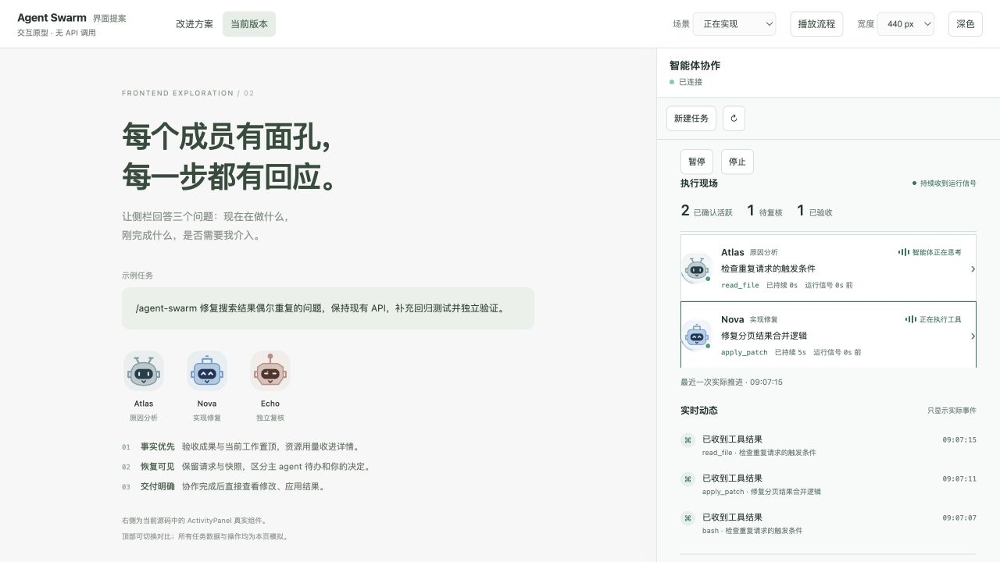
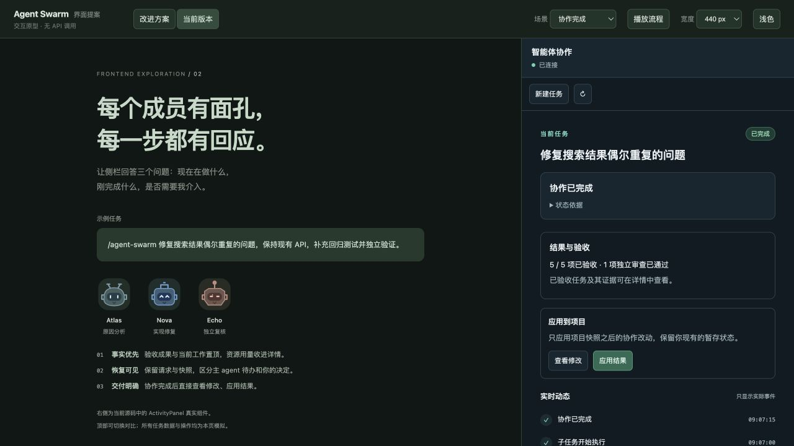
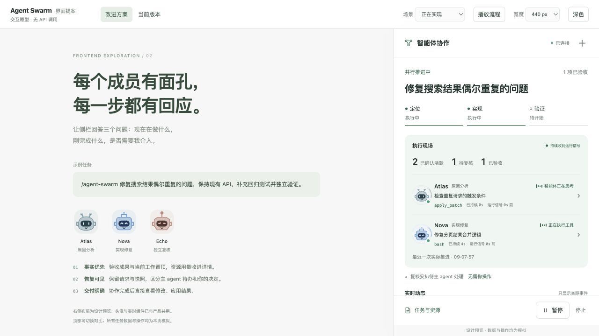
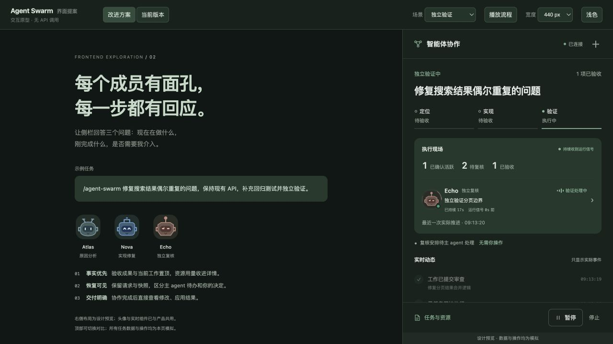
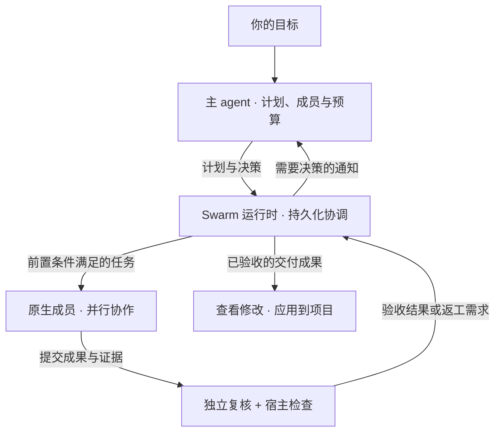

# Agent Swarm for DeepSeek Harness

[English](README.md) · **简体中文**

### 一个目标，一支协作团队，一份可审查的成果。

描述你想构建的功能、修复的问题或调查的方向。Agent Swarm 将一支协作团队带入 [DeepSeek Harness](https://github.com/deepseek-ai/deepseek-harness)：成员围绕共同目标工作，执行过程清晰可见，成果经过独立复核，再由你决定如何带回项目。

```text
/agent-swarm 修复搜索结果重复的问题。保留现有 API，补充回归测试，并独立验证修改。
```

主 agent 理解项目、组织工作，并根据任务决定成员和资源预算。你可以在侧栏跟进任务，在成果就绪后查看修改。

**v0.7.0 · MIT 开源 · 本地 Git 项目 · 原生集成 Harness**

[开始使用](#get-started) · [查看界面](#ui-gallery) · [了解架构](#architecture) · [English](README.md)

## 适合交给团队的工作

| 你的目标 | 团队如何协作 |
| --- | --- |
| 修复难以定位的问题 | 调查原因、实现修复，再由其他成员检查边界情况。 |
| 完成横跨多个模块的功能 | 拆分可以并行的工作，协调依赖，整合经过复核的成果。 |
| 理解陌生代码 | 收集证据、对照不同发现，并按要求提供不修改代码的分析。 |

**你描述结果，主 agent 组织协作。** 每次启动无需填写成员人数或 token 预算。成员可以在任务范围内交换发现、相互询问、质疑证据，并交接阶段成果。

## 从一句需求，到项目中的改进

1. **从项目现状出发。** 规划前先创建私有 Git 快照，包含已跟踪文件的改动和未被忽略的新文件。无需手动 commit，快照过程保留你的分支、暂存区和工作文件。
2. **让成员协同推进。** 主 agent 按可独立验收的结果和真实前置条件拆解工作。偏好成员忙碌时，满足执行条件的空闲成员可以接取尚未开始的待办；明确绑定和在途任务仍受保护。成员使用原生 Harness 会话与独立 Git worktree。
3. **复核实际提交的成果。** 由其他成员审查提交内容。对于代码任务，Harness 还会在准确的提交版本上执行声明的检查。
4. **就绪后再带回项目。** 任务完成后，侧栏为最终已验收的代码成果提供“查看修改”和“应用结果”。应用以初始快照为基准，保留你的分支和暂存区，不会自动暂存、提交或推送。

你原有的编辑属于任务基线，不会被算成 swarm 新增成果。检测到合并冲突时，会先报告，再由你处理。

## 随时知道任务在做什么

侧栏回答三个实际问题：**谁在工作？刚刚发生了什么？哪里需要处理？**

- **认得出每个成员。** 宿主持久分配名字，职责单独展示，仍支持明确自定义名字；稳定的机器人头像不会因改名或职责调整而改变；打开成员会话即可查看具体工作。
- **看得见当前执行。** 展示正在进行的操作、持续时间，以及 Harness 最近一次观察到活动的时间。新鲜的活动信号驱动动画；信号过期后显示为待确认。
- **用事件呈现进展。** 工具结果、提交和验收进入活动流。资源用量保留在详情里，不会被当作完成百分比。
- **操作就在手边。** 在侧栏暂停、继续或停止任务；启动失败时，也能对已保存的规划请求执行恢复操作。

界面跟随宿主状态更新，渲染本身不调用模型。操作活跃说明宿主观察到了执行，不等于已经产出有效成果。

<a id="ui-gallery"></a>

## 界面预览

以下截图于 2026 年 9 月 15 日拍摄，使用模拟任务和事件。外围页面是本地预览框架，并非 Harness 应用界面。点击图片可查看大图。

**当前插件组件**：前两张图由真实的 `ActivityPanel` 源码组件配合模拟数据渲染。

| 成员实时活动 · 浅色主题 | 已验收成果与交付 · 深色主题 |
| --- | --- |
| [](docs/images/live-work-light.jpg) | [](docs/images/delivery-dark.jpg) |
| 查看成员当前操作、持续时间与近期工具事件。 | 查看已验收成果，自主决定何时应用到项目。 |

**设计预览**：共用的头像和实时活动组件已接入插件；下面展示的完整简化布局仍是渲染器原型。

| 简化侧栏布局 · 预览 | 独立验证进行中 · 深色预览 |
| --- | --- |
| [](docs/images/sidebar-preview-light.jpg) | [](docs/images/verification-preview-dark.jpg) |
| 将目标、并行工作和任务操作放在一起。 | Echo 正在复核其他成员的提交，该提交尚待验收。 |

## 中断之后，仍有继续推进的路径

长任务需要的不只是启动按钮。Agent Swarm 将分工、证据、决策和恢复状态保存到磁盘，支持在已覆盖的中断与重启场景中继续工作。

**返工保留原来的任务目标。** 主 agent 可以在原任务上修订执行额度和未提交工作的计划，也能按新版本修复启动失败的保存计划。已提交工件保留精确审查来源；需要替代工件时，替代任务继承原验收标准，下游依赖跟随已验收的修复。

**需要判断时，交回主 agent。** 审查驳回、工作受阻、供应商异常或预算耗尽等情况可以产生持久通知。主 agent 能调整计划、安排修复，或附带原因修改预算。常规恢复决策无需你重新配置团队。

**完成必须有依据。** 尚未完成的合成和复核会留在任务板上，并通知主 agent 修复。没有可运行任务，不会触发静默撤回必要工作或宣布完成。

**资源使用始终可查。** 主 agent 决定团队规模、任务上限、步数与 token 预算、恢复次数和验证超时。用量按团队记录，展示缓存和输出等明细，并单独列出主会话用量。继续任务不会重置已消耗的资源。原生 worker 会话需要重建时，持久化的会话计量代次会区分新旧水位，保留历史累计并继续记录新增用量。

恢复受任务预算与期限约束。主 agent 离线时通知会排队；卡住的原生模型调用也可能延迟消息处理。供应商用量上报和在途请求的估算，仍可能使实际用量超过预算。

<a id="architecture"></a>

## 产品架构

**主 agent 决定方向，运行时协调工作，Harness 执行智能体。**



**明确规则之内，保留协作自由。** 成员可以共享证据、提出后续工作；运行时检查范围、依赖和复核要求。成员之间的消息不能扩大权限、提高预算或豁免独立审查。

**恢复属于协调过程。** 持久状态把任务与执行实例、成果、决策关联起来。执行中断后，运行时拒绝旧实例继续写入，并通过支持的检查点、重试或重新分配路径恢复。需要判断的情况交回主 agent；已验收的替代成果成为下游任务的新前置条件。

**原生执行，统一呈现。** Harness 提供模型执行、会话、收件箱、工具和沙箱。插件负责协作与验收规则，侧栏展示任务状态和观察到的活动。协作消息进入原生收件箱与会话记录，协调数据保存在 SQLite 中，无需修改或 fork Harness 核心。

实现约定与设计来源见[设计说明](docs/design.md)。

<a id="get-started"></a>

## 开始使用

Agent Swarm 当前以源码插件形式提供。你需要：

- **Node.js `^22.19.0 || >=24.0.0`、Git，以及 macOS 或 Linux。** 任务在本地 Git 仓库中执行。
- **已构建的受支持 DeepSeek Harness。** 最新支持 `0.1.6-alpha.2`，另外支持 `0.1.5-rc.1`、`0.1.3-alpha.2` 和 `0.1.2-rc.1`；准确版本见[兼容矩阵](compatibility.json)。用 `DSH_SOURCE` 指定检出，否则启动脚本先取 `~/.dsh/source/current`。
- **可用的 Harness 模型配置。** 凭据由宿主管理；除非计划指定其他模型路由，成员默认沿用主会话模型。

```sh
git clone https://github.com/TT-Wang/dsh-agent-swarm.git
cd dsh-agent-swarm
export DSH_HARNESS_ROOT="/absolute/path/to/deepseek-harness"
npm run link:dsh
npm run build
node "$DSH_HARNESS_ROOT/apps/cli/lib/bin.js" plugin --profile web add "link:$PWD"
```

从准备开展任务的项目目录启动 Harness：

```sh
cd /absolute/path/to/your-project
node "$DSH_HARNESS_ROOT/apps/cli/lib/bin.js" --profile web
```

打开 Harness 输出的已认证启动链接，在会话中选择模型，输入 `/agent-swarm` 加上自然语言目标即可。该命令已注册到原生命令补全中。

在受支持的 `0.1.5-rc.1` 与 `0.1.6-alpha.2` 宿主上，Agent Swarm 位于原生右侧栏，默认折叠；0.1.6 上也可从右侧栏 Start 页的卡片打开。发送 `/agent-swarm` 加自然语言目标后会自动展开；也可以随时点击左侧导航底部的 Agent Swarm 按钮重新打开。较早的受支持版本优先使用 Better Sidebar，否则使用插件自身的停靠面板。界面支持中英文和深浅主题。

Bundle 安装、升级、启动恢复与配置详见[使用与运维指南](docs/operations.zh-CN.md)。

## 适用范围与实际边界

- **本地执行。** 不支持分布式成员、非 Git 项目或 Windows 执行。多个宿主需要独立状态目录，不支持并发恢复同一数据库。保留的 worktree 与成果引用需要显式清理。
- **可审查的证据。** 独立复核与宿主检查让验收有据可查，但无法保证所选检查覆盖所有要求。验证默认复制已有依赖及常见虚拟环境解释器，仍可能依赖宿主系统库。不支持的外部依赖链接需要改为自包含安装或由宿主显式授权；这不是全新的 CI 环境。
- **工作区权限由人配置。** 任务使用会话所在工作区，或 `authorizedWorkspaces` 配置的根目录；匹配的授权记录为 `workspaceGrantRoot`。智能体不能通过 swarm 工具自行新增授权。执行边界沿用 Harness 沙箱，插件不额外提供网络或凭据隔离。
- **文件交付物。** 成员通过 `swarm_submit.deliverables` 列出准确的相对文件路径，独立复核报告可用可选的 `swarm_verify.deliverables`；即使被 Git 忽略，宿主也能只捕获这些明确文件，不修改源检出的忽略规则。提交回显绑定 commit 的 blob ID 和字节数，复核以固定源 commit 为准，主机检查在该版本的新检出中执行，作者后续覆写不会改变被复核的报告。同源复核改派会保留已保存草稿。每个任务还要声明 `outputs`，即它必须产出的文件：宿主会捕获每个声明的输出（即使被 Git 忽略），声明的输出缺失时以 `[output_missing]` 拒绝提交，交接时保留声明的草稿，未声明 outputs 的计划任务不能启动（`[]` 表示纯分析任务）；宿主不再从任务文字推断路径，既未声明也未列出的忽略文件不会被捕获；未声明的忽略文件不会自动收集，发生覆盖冲突时会停止切换工作区并提示路径。
- **检查边界。** 实际代码、配置改动即使标为 research 也需要宿主检查，普通报告保留轻量独立复核。明确的空操作检查会被拒绝，但文件格式分类不等于程序语义分析，检查是否覆盖验收条件仍需复核人判断。升级不会追溯重审已有 accepted 历史。已提交产物可以在原任务上追加检查，不必取消重建。
- **可观察、有边界的恢复。** 实时界面展示操作和事件，不提供逐 token 输出或保证准确的完成时间。恢复机制不承诺外部副作用恰好执行一次、任意磁盘故障恢复或整个文件系统上的原子应用。

详细约束与剩余风险见[已知限制](docs/known-limitations.md)，集成验证依据见[验证记录](docs/validation.md)。使用脚本化模型响应的测试不能当作模型质量或速度基准。

## 文档与生态

| 延伸阅读 | 内容 |
| --- | --- |
| [中文使用指南](docs/operations.zh-CN.md) · [English guide](docs/operations.md) | 安装、支持版本、存储、配置、恢复与开发命令。 |
| [设计说明](docs/design.md) | 协作约定、权限边界和设计溯源。 |
| [验证记录](docs/validation.md) | 已完成的集成检查及其证据边界。 |
| [已知限制](docs/known-limitations.md) | 详细运行约束与尚存问题。 |

Agent Swarm 可以与 [dsh-slice-agent-loop](https://github.com/TT-Wang/dsh-slice-agent-loop) 配合管理会话上下文：Swarm 协调成员之间的工作，slice 策略管理每个会话内的历史。详见[组合使用说明](docs/operations.zh-CN.md#companion-context-policy)。

欢迎参与改进。开发验证需要完整仓库，参见[开发命令](docs/operations.zh-CN.md#development-and-verification)。真实供应商测试需显式运行，可能产生 API 费用。

## 开源协议

MIT · [开源协议](LICENSE) · [第三方声明](NOTICE)
